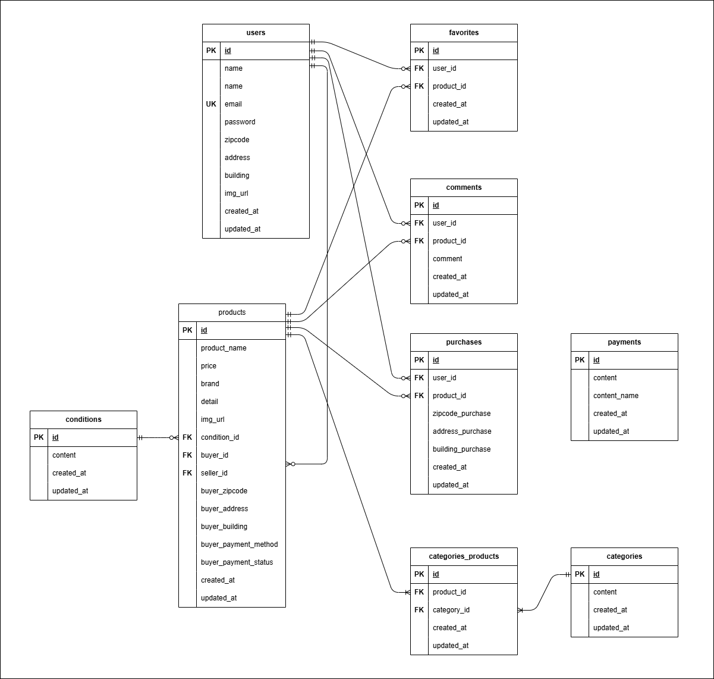

# 模擬案件 フリマアプリ

## 環境構築
**Dockerビルド**
1. `git clone git@github.com:hktooooo/free_market_app.git`
2.  DockerDesktopアプリを立ち上げる
3. `docker-compose up -d --build`

**Laravel環境構築**
1. `docker-compose exec php bash`
2. `composer install`
3. 「.env.example」ファイルを 「.env」ファイルに命名を変更。または、新しく.envファイルを作成
4. .envに以下の環境変数を追加
- SQLデータベース
``` text
DB_CONNECTION=mysql
DB_HOST=mysql
DB_PORT=3306
DB_DATABASE=laravel_db
DB_USERNAME=laravel_user
DB_PASSWORD=laravel_pass
```


- Mail Hog
``` text
MAIL_MAILER=smtp
MAIL_HOST=mailhog
MAIL_PORT=1025
MAIL_USERNAME=null
MAIL_PASSWORD=null
MAIL_ENCRYPTION=null
MAIL_FROM_ADDRESS="test@example.com"
MAIL_FROM_NAME="${APP_NAME}"
```

- Stripe
``` text
STRIPE_KEY=(各自のSTRIPE_KEYを記入)
STRIPE_SECRET=(各自のSTRIPE_SECRETを記入)
```

5. アプリケーションキーの作成（phpコンテナ内で実行）
``` bash
php artisan key:generate
```

6. Fortifyの導入（phpコンテナ内で実行）
``` bash
composer require laravel/fortify
php artisan vendor:publish --provider="Laravel\Fortify\FortifyServiceProvider"
```

7. stripeの導入（phpコンテナ内で実行）
``` bash
composer require stripe/stripe-php
```

8. イメージデータのセットアップ
- 保存先の作成
``` bash
mkdir src/storage/app/public/product_images
mkdir src/storage/app/public/profile_images
```
- サンプルイメージコピー
``` bash
cp src/public/images/sample_images/* src/storage/app/public/product_images
```
- ストレージフォルダのリンク作成（phpコンテナ内で実行）
``` bash
php artisan storage:link
```

8. マイグレーションの実行（phpコンテナ内で実行）
``` bash
php artisan migrate
```

9. シーディングの実行（phpコンテナ内で実行）
``` bash
php artisan db:seed
```

10. テスト環境の作成
``` bash
cp .env .env.testing
```
- .env.testの以下の環境変数を変更
``` text
APP_ENV=test
APP_KEY= 
(APP_KEYは空にする)

DB_CONNECTION=mysql_test
DB_HOST=mysql
DB_PORT=3306
DB_DATABASE=demo_test
DB_USERNAME=root
DB_PASSWORD=root
```
- キーの作成とマイグレーションの実行（phpコンテナ内で実行）
``` bash
php artisan key:generate --env=testing
php artisan config:clear
php artisan migrate --env=testing
```
## 注
- PaymethodTest.phpに関しては Laravel Duskのインストール設定ができていないため、実行することができません
- Soldとなった商品および、自分が出品した商品に関しては、"購入手続きへ"のボタンの非表示化とルーティングの条件設定により再購入ができない仕様を追加しています（元々の要件からの独自追加点）

## 使用技術(実行環境)
- PHP8.2.29
- Laravel8.83.29
- MySQL8.0.26

## ER図


## URL
- 開発環境：http://localhost/
- phpMyAdmin:：http://localhost:8080/
- MailHog:：http://localhost:8025/