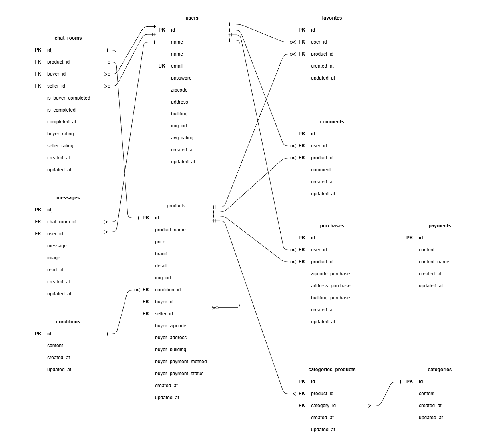

# 模擬案件 フリマアプリ

## 環境構築
**Dockerビルド**
1. `git clone git@github.com:hktooooo/free_market_app.git`
2.  DockerDesktopアプリを立ち上げる
3. プロジェクト直下で、以下のコマンドを実行する

```
make init
```

## SQLデータ
.envファイルの環境変数は以下となっています。<br>
``` text
DB_CONNECTION=mysql
DB_HOST=mysql
DB_PORT=3306
DB_DATABASE=laravel_db
DB_USERNAME=laravel_user
DB_PASSWORD=laravel_pass
```

## メール認証
mailHogを使用しています。<br>
.envファイルの環境変数は以下となっています。<br>
``` text
MAIL_MAILER=smtp
MAIL_HOST=mailhog
MAIL_PORT=1025
MAIL_USERNAME=null
MAIL_PASSWORD=null
MAIL_ENCRYPTION=null
MAIL_FROM_ADDRESS="test@example.com"
MAIL_FROM_NAME="${APP_NAME}"
```

## Stripe設定
.envファイルの環境変数は以下を各自入力してください。<br>
``` text
STRIPE_KEY=(各自のSTRIPE_KEYを記入)
STRIPE_SECRET=(各自のSTRIPE_SECRETを記入)
```

## テーブル仕様
### usersテーブル
| カラム名 | 型 | primary key | unique key | not null | foreign key |
| --- | --- | --- | --- | --- | --- |
| id | bigint | ◯ |  | ◯ |  |
| name | varchar(255) |  |  | ◯ |  |
| email | varchar(255) |  | ◯ | ◯ |  |
| email_verified_at | timestamp |  |  |  |  |
| password | varchar(255) |  |  | ◯ |  |
| remember_token | varchar(100) |  |  |  |  |
| zipcode | varchar(255) |  |  |  |  |
| address | varchar(255) |  |  |  |  |
| building | varchar(255) |  |  |  |  |
| img_url | varchar(255) |  |  |  |  |
| rating | decimal |  |  |  |  |
| created_at | timestamp |  |  |  |  |
| updated_at | timestamp |  |  |  |  |

### productsテーブル
| カラム名 | 型 | primary key | unique key | not null | foreign key |
| --- | --- | --- | --- | --- | --- |
| id | bigint | ◯ |  | ◯ |  |
| product_name | varchar(255) |  |  | ◯ |  |
| price | bigint |  |  | ◯ |  |
| brand | varchar(255) |  |  |  |  |
| detail | text |  |  | ◯ |  |
| img_url | varchar(255) |  |  | ◯ |  |
| condition_id | bigint |  |  | ◯ | conditions(id) |
| buyer_id | bigint |  |  |  | users(id) |
| seller_id | bigint |  |  | ◯ | users(id) |
| buyer_zipcode | varchar(255) |  |  |  |  |
| buyer_address | varchar(255) |  |  |  |  |
| buyer_building | varchar(255) |  |  |  |  |
| buyer_payment_method | varchar(255) |  |  |  |  |
| buyer_payment_status | varchar(255) |  |  |  |  |
| created_at | timestamp |  |  |  |  |
| updated_at | timestamp |  |  |  |  |

### categoriesテーブル
| カラム名 | 型 | primary key | unique key | not null | foreign key |
| --- | --- | --- | --- | --- | --- |
| id | bigint | ◯ |  | ◯ |  |
| content | varchar(255) |  |  | ◯ |  |
| created_at | timestamp |  |  |  |  |
| updated_at | timestamp |  |  |  |  |

### conditionsテーブル
| カラム名 | 型 | primary key | unique key | not null | foreign key |
| --- | --- | --- | --- | --- | --- |
| id | bigint | ◯ |  | ◯ |  |
| content | varchar(255) |  |  | ◯ |  |
| created_at | timestamp |  |  |  |  |
| updated_at | timestamp |  |  |  |  |

### categories_productsテーブル
| カラム名 | 型 | primary key | unique key | not null | foreign key |
| --- | --- | --- | --- | --- | --- |
| id | bigint | ◯ |  | ◯ |  |
| category_id | bigint |  |  | ◯ | categories(id) |
| product_id | bigint |  |  | ◯ | products(id) |
| created_at | timestamp |  |  |  |  |
| updated_at | timestamp |  |  |  |  |

### favoritesテーブル
| カラム名 | 型 | primary key | unique key | not null | foreign key |
| --- | --- | --- | --- | --- | --- |
| id | bigint | ◯ |  | ◯ |  |
| user_id | bigint |  |  | ◯ | users(id) |
| product_id | bigint |  |  | ◯ | products(id) |
| created_at | timestamp |  |  |  |  |
| updated_at | timestamp |  |  |  |  |

### commentsテーブル
| カラム名 | 型 | primary key | unique key | not null | foreign key |
| --- | --- | --- | --- | --- | --- |
| id | bigint | ◯ |  | ◯ |  |
| user_id | bigint |  |  | ◯ | users(id) |
| product_id | bigint |  |  | ◯ | products(id) |
| comment | text |  |  |  |  |
| created_at | timestamp |  |  |  |  |
| updated_at | timestamp |  |  |  |  |

### purchasesテーブル
| カラム名 | 型 | primary key | unique key | not null | foreign key |
| --- | --- | --- | --- | --- | --- |
| id | bigint | ◯ |  | ◯ |  |
| user_id | bigint |  |  | ◯ | users(id) |
| product_id | bigint |  |  | ◯ | products(id) |
| zipcode_purchase | varchar(255) |  |  |  |  |
| address_purchase | varchar(255) |  |  |  |  |
| building_purchase | varchar(255) |  |  |  |  |
| created_at | timestamp |  |  |  |  |
| updated_at | timestamp |  |  |  |  |

### paymentsテーブル
| カラム名 | 型 | primary key | unique key | not null | foreign key |
| --- | --- | --- | --- | --- | --- |
| id | bigint | ◯ |  | ◯ |  |
| content | varchar(255) |  |  | ◯ |  |
| content_name | varchar(255) |  |  | ◯ |  |
| created_at | timestamp |  |  |  |  |
| updated_at | timestamp |  |  |  |  |

### chat_roomsテーブル
| カラム名 | 型 | primary key | unique key | not null | foreign key |
| --- | --- | --- | --- | --- | --- |
| id | bigint | ◯ |  | ◯ |  |
| product_id | bigint |  |  | ◯ | products(id) |
| buyer_id | bigint |  |  | ◯ | users(id) |
| seller_id | bigint |  |  | ◯ | users(id) |
| created_at | timestamp |  |  |  |  |
| updated_at | timestamp |  |  |  |  |

### messagesテーブル
| カラム名 | 型 | primary key | unique key | not null | foreign key |
| --- | --- | --- | --- | --- | --- |
| id | bigint | ◯ |  | ◯ |  |
| chat_room_id | bigint |  |  | ◯ | chat_rooms(id) |
| user_id | bigint |  |  | ◯ | users(id) |
| message | text |  |  |  |  |
| image | varchar(255) |  |  |  |  |
| read_at | timestamp |  |  |  |  |
| created_at | timestamp |  |  |  |  |
| updated_at | timestamp |  |  |  |  |

## ER図


## テストユーザーアカウント
name: seller1
email: seller1@test.com 
password: 12345678
*C01~C05の商品を出品したユーザ
-------------------------
name: seller2
email: seller2@test.com 
password: 12345678
*C06~C10の商品を出品したユーザ
-------------------------
name: test_user
email: test@test.com
password: 12345678
*テストユーザ（商品に紐づけなし）
-------------------------

## PHPUnitを利用したテストに関して
以下のコマンドを順に実行:  
```text
//MySQLコンテナ上でテスト用データベースの作成
docker-compose exec mysql bash

//MySQLコンテナ上
mysql -u root -p

//パスワードはrootと入力
CREATE DATABASE demo_test;
SHOW DATABASES;

SHOW DATABASES;入力後、demo_testが作成されていれば成功
exitでコンテナを抜ける

//テスト用の.envファイル作成
docker-compose exec php bash
cp .env .env.testing

//※Windows WSL環境下では、PHPコンテナ抜けてから下記コマンドでファイル権限を与える必要がある
sudo chown -R $USER:$USER src/

.env.testingの以下の環境変数を書き換える

    APP_NAME=Laravel
    APP_ENV=test
    APP_KEY=
    APP_DEBUG=true
    APP_URL=http://localhost

    DB_CONNECTION=mysql
    DB_HOST=mysql
    DB_PORT=3306
    DB_DATABASE=demo_test
    DB_USERNAME=root
    DB_PASSWORD=root

// 以下を PHPコンテナ内で実行 (docker-compose exec php bashでコンテナに入る)
// 「空」にしたAPP_KEYに新たなテスト用のアプリケーションキーを加える
php artisan key:generate --env=testing

// キャッシュのクリアとマイグレーションコマンドの実行
php artisan config:clear
php artisan migrate:fresh --env=testing

./vendor/bin/phpunit tests/Feature/ファイル名.php
で各テスト実行ができます
```
## 使用技術(実行環境)
- PHP8.2.29
- Laravel8.83.29
- MySQL8.0.26

## URL
- 開発環境：http://localhost/
- phpMyAdmin:：http://localhost:8080/
- MailHog:：http://localhost:8025/